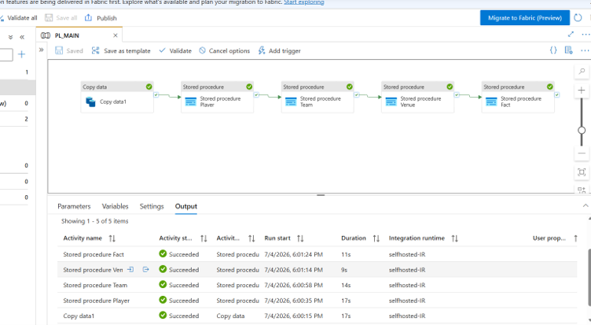

# 🏏 IPL 2026 Data Analytics — End-to-End Azure Data Pipeline

An end-to-end data engineering and analytics project built on the **IPL 2026 dataset**, covering the full journey from raw CSV files to an interactive Power BI dashboard. I chose cricket data because it's a domain I genuinely enjoy exploring — and it offers rich, real-world modelling challenges (matches, teams, players, venues) that map naturally to dimensional design.

---

## 🔧 Tech Stack

| Layer | Tool |
|---|---|
| Orchestration / Ingestion | Azure Data Factory (ADF) |
| Staging Storage | Azure Blob Storage |
| Database | Microsoft SQL Server (SQLEXPRESS) |
| Transformation | T-SQL (Stored Procedures) |
| Data Modelling | Star Schema (Kimball methodology) |
| Reporting | Power BI |
| Source Control | GitHub (ADF Git integration) |

---

## 🏗️ Architecture Overview

```
IPL 2026 CSVs  →  Azure Blob Storage  →  ADF Copy Activity  →  Staging (dbo.IplData)
                                                                      │
                                                        Stored Procedure (T-SQL)
                                                                      │
                                                     Star Schema (Dims + Fact)
                                                                      │
                                                              Power BI Dashboard
```

---

## ⚙️ ADF Pipeline


The pipeline consists of two key activities running in sequence:

1. **Copy Activity** — Ingests the raw CSV data from Azure Blob Storage and lands it into a staging table (`dbo.IplData`) in SQL Server. A Self-Hosted Integration Runtime (SHIR) is used to connect ADF in the cloud to the on-premises SQL Server Express instance.
2. **Stored Procedure Activity** — Executes a T-SQL stored procedure at run time that transforms and migrates data from the staging table into the dimensional model (dimension and fact tables), loading them in the correct dependency order.

---

## ⭐ Data Modelling — Star Schema

The warehouse follows **Kimball dimensional modelling** principles:

- **Fact table** holds the measurable values (match results, scores, margins)
- **Dimension tables** hold the descriptive context used for slicing and filtering


| Table | Type | Description |
|---|---|---|
| `FactMatch` | Fact | One row per match — measures and foreign keys |
| `DimTeam` | Dimension | Team attributes (role-playing: home team / away team) |
| `DimPlayer` | Dimension | Player attributes |
| `DimVenue` | Dimension | Stadium / city / location attributes |

Design decisions include **surrogate keys** (via `IDENTITY`) on all dimensions and **role-playing dimensions** where the same dimension (e.g. `DimTeam`) plays multiple roles in the fact table.

---

## 🔄 Transformation Approach — ELT

This project follows an **ELT** pattern rather than traditional ETL:

- **E — Extract:** Raw CSV files sourced and placed in Azure Blob Storage
- **L — Load:** Data loaded as-is into SQL Server staging (`dbo.IplData`) via ADF
- **T — Transform:** All transformation happens *inside* SQL Server using T-SQL stored procedures, reshaping staged data into the star schema

This keeps the raw data intact in staging and makes transformations repeatable, debuggable, and version-controlled.


---

## 📊 Power BI Dashboard

The final star schema feeds an interactive **Power BI dashboard** for easy analysis and decision-making — enabling views across teams, players, venues, and match outcomes.

<!-- 📸 Add dashboard screenshot here -->


---

## 📁 Repository Structure

This repo is the live Git integration for the Azure Data Factory instance — the pipeline itself, as code:

```
├── dataset/              # ADF dataset definitions (JSON)
├── factory/              # Factory-level configuration
├── integrationRuntime/   # Self-Hosted Integration Runtime definition
├── linkedService/        # Connections to Blob Storage & SQL Server
├── pipeline/             # Pipeline definition (JSON)
└── publish_config.json   # ADF publish configuration
```

---

## 🚀 Key Learnings

- Configuring **ADF Git integration** with a save → publish workflow (source-controlled development vs. live deployment)
- Setting up a **Self-Hosted Integration Runtime** to bridge cloud ADF and a local SQL Server Express instance
- Applying **Kimball methodology** — staging area vs. presentation area, atomic grain, surrogate keys, role-playing dimensions
- Choosing **ELT over ETL** to leverage SQL Server's transformation power

---

## 📌 Dataset

**IPL 2026 dataset** (Kaggle) — match-level cricket data across the 2026 Indian Premier League season.

---

*Built by [Sehaj Kaur](https://github.com/SehajKaur03) — aspiring Data Analyst | SQL · Power BI · Azure · Python*
